# Intro

The code was designed to have clear responsibilities and to be easy to test and mock. I developed it guided to interfaces.

# Test Coverage

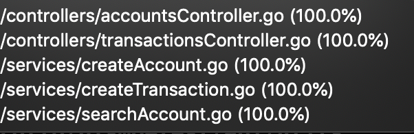

# Folder Structure

## **api/services**

Here is the brain, the core use cases is written here. Files here will be responsible for use cases like: Create a Transaction and an Account

## **api/controllers**

Where I store the transactionsController and accountsController. Their responsibility is to get a request, call a service and return a response to the client.

## **api/models**

A model is a structure that shapes the data. It defines the column attributes and it is used for migrations. I don't store any business logic here

## **api/repositories**

Here I'm storing some structs that will make the queries in the DB. Create, Update, Delete and Find queries are wrapped inside it. This way my service doesn't need to know which adapter is being used (postgres, mysql, mongo, etc...)

# API Doc

## POST /accounts

- Create Valid account
  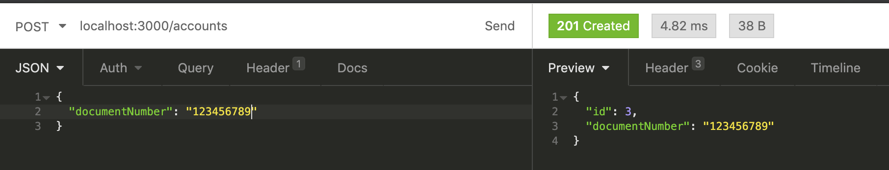

- Invalid Account (non-numeric document number)
  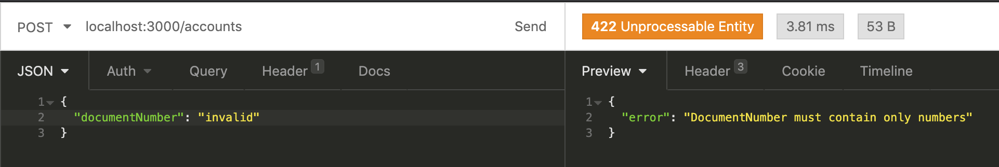

- Invalid Account (empty document number)
  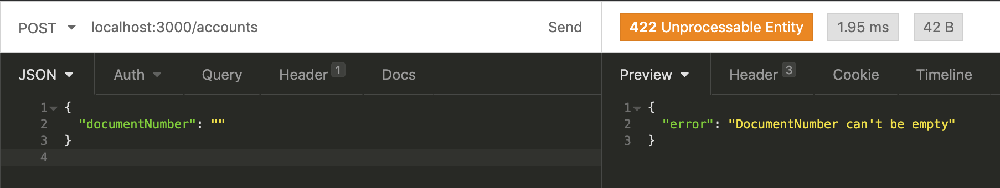

## GET /accounts/:id

- Existent account
  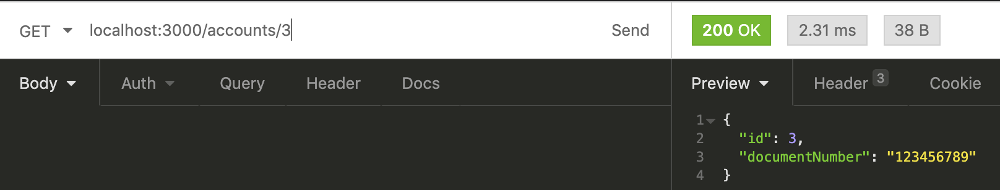

- Non existent account
  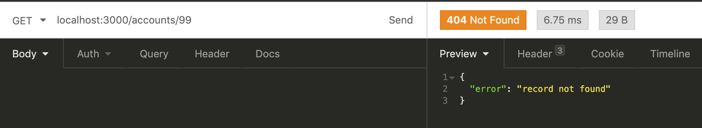

## POST /transactions

- Valid transactions
  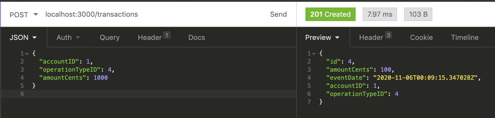

  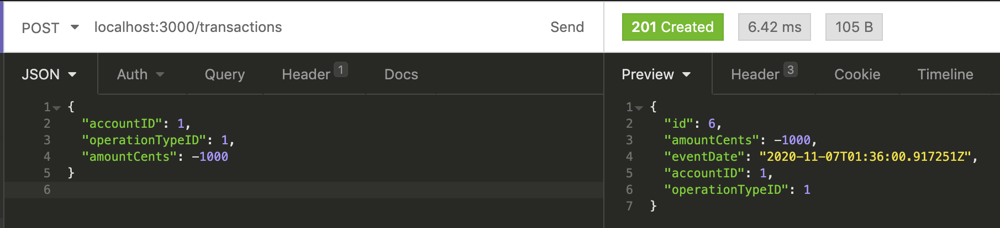

- Invalid transactions
  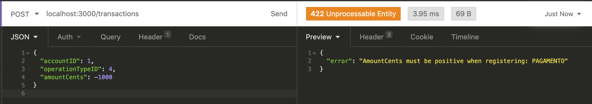

  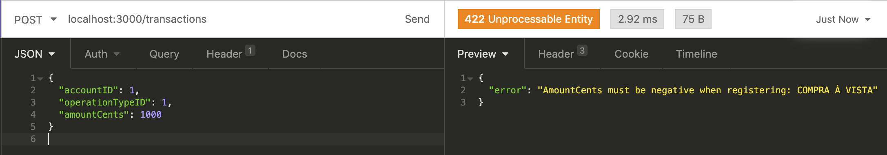

  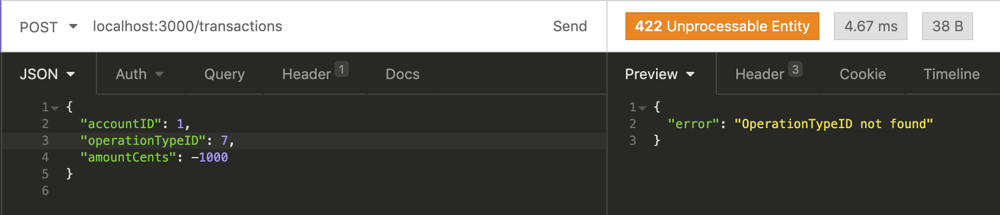

# How to run

```
$ git pull https://github.com/emmanuelperotto/transactions.git
```

```
$ cd pismo-test
```

```
$ docker-compose up --build
```

# How to run the tests

```
$ go test -coverprofile=coverage.out -v ./...
$ go tool cover -html=coverage.out
```
